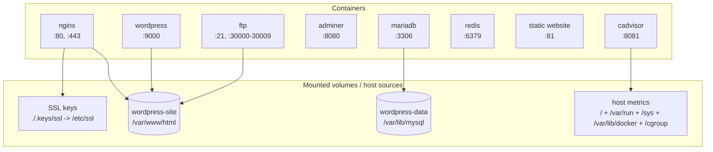

# Inception

*This project has been created as part of the 42 curriculum by zpiarova.*

## Description

The task is to set up a small infrastructure composed of different services to learn the basics of system adinistration. 
The mandatory part requires 3 containers that communicate over docker network. Bonus adds 4 additional containers.

### REQUIREMENTS

- **Mariadb** container creates db to store the contents of the wordpress sites.
- **Wordpress** container runs php-fpm service that gets php requests and returns html pages.
- **Nginx** serves static sites and also proxies php requests to the wordpress container.

+ **/home/zpiarova/data/wordpress-data** is mounted to mariadb db and persists data.
+ **/home/zpiarova/data/wordpress-site** is mounted to wordpress and nginx containers to store static files - nginx serves them, wordpress stores them here. 

### BONUS
- **Adminer** container runs a database client with a web UI so the MariaDB database can be inspected and managed from the browser.
- **FTP** container runs an FTP server mounted to the shared WordPress website volume so uploaded files appear directly in the web root.
- **Redis** container provides in-memory caching for WordPress and exposes a health check so the app can verify its connection to the cache.
- **cAdvisor** container exposes Docker and host resource metrics on the `/metrics` endpoint for monitoring and observability.
- **Static Website** serves a small HTML/CSS/JS Tetris game on a dedicated HTTP port and is mounted as a separate site directory.



## Containers 

### NGINX

`nginx.conf` configures two Nginx server blocks:
- First server block serves the wordpress application on port 443.
- Second server block serves the static website on port 80. It is a placeholder tetris game.

Domain name points to a local address.
Browser reads hosts and turns the domain into 127.0.0.1.
Browser connects to 127.0.0.1:443.
The OS sees Nginx is listening on 443 and passes the connection to it.
Nginx uses the domain in the request to choose the right server block and certificate.

#### Wordpress Site
It forwards php requests for html pages to wordpress container and serves static files directly from mounted volume.

**For php code requests (GET *.php)** where php must read db and construct the html page, nginx acts s reverse proxy - terminates TLS v1.2 and proxies them to wordpress service (php-fpm) via FastCGI on port 9000. WordPress page is dynamically generated by PHP/WordPress and returned through Nginx. FastCGI is the communication protocol between Nginx and PHP-FPM.

**For static file requests** (GET *.jpg, *.css, *.javascript, fonts, ...), it serves them from /var/www/html which is also mounted to the wordpress container and on the host volume /home/zpiarova/data/wordpress-site. No php is involved.

Generate the SSL certificates and private keys on the host andmount them rather than generating or copying them during the image build. This keeps the private key out of the Docker image, so anyone with access to the image cannot simply extract it, and also makes certificate rotation easier: when the certificate expires, I can replace the files on the host without rebuilding the Docker image.

Verify its working:
1. `https://${DOMAIN_NAME}:8443` - wordpress website - 8443 because on host 443 is not available
2. `curl -vk https://localhost:443` - on the vm check the correct port is serving

### WORDPRESS

A `01-setup.sh` script runs on container start to set wp on the container, waiting for db to be created. It is not done during the build since it performs things that depend on the runtime environment as databases to which the script connects may not be created yet.

A php-fpm service is running on the wordpress container. PHP-FPM executes PHP, WordPress is the PHP application containing the actual business logic.WordPress is PHP software that needs PHP to execute it as the final HTML page usually isn't stored in volume as about.html. Instead, WordPress generates it when requested. Static files used by the html file are stored in the volume and are retrieved by nginx upon browser request. PHP-FPM is a PHP process manager that can execute PHP code to create HTML response. PHP-FPM keeps PHP worker processes running and accepts FastCGI requests from Nginx. 

It connects to the mariadb container using SQL over network to store and retrieve posts and other data.

It mounts host volume /home/zpiarova/data/wordpress-data to /var/www/html on the container where it stores static files as images, fonts, css, javascript, etc., from where nginx can read it, and also to persist website files.

wp core install creates a default sample page and a default Hello world post.
init script creates 3 posts. 

Verify it's working:
1. Check the website is working and constructing pages
2. `https://zpiarova.42.fr/wp-admin` - wp admin page - admin web UI, check users match the adminer

### MARIADB

mariadb-server installs client tools needed to interact with it including mysql.

Container starts with the `01-db-init.sh` script which creates the database and user.

When the script finishes, it runs mariadbd - a MariaDB/MySQL helper for starting the database server, and logs to the console.

Mariadb mounts `/home/zpiarova/data/wordpress-data` on host to `/var/lib/mysql` on container, since MariaDB stores database files under configured data directory, which on Debian is normally `/var/lib/mysql`.

Mariadbd then runs on the container and waits for db requests from the wordpress container.

Verify it's working:
1. Check the site works and gets data from the db
2. Check adminer (bonus) for the data

### STATIC WEBSITE (BONUS)

A simple html+css+js website for playing tetris. 

Verify its working:
1. `http://${DOMAIN_NAME}:81` - static website

### ADMINER (BONUS)

Container runs a database client with web UI view to provide admin view of the database.

Verify its working:
1. Open `https://${DOMAIN_NAME}:8080` - use db credentials from .env (for server use container name from docker network - 'mariadb')

### REDIS (BONUS)

TODO: description

Verify its working:
1. Redis is alive: `docker exec srcs-redis-1 redis-cli -a <password> ping`: should return `PONG`
2. Wp can communicate with redis: `docker exec srcs-wordpress-1 wp redis status --allow-root`: should return Status: Connected, Client: PhpRedis, Drop-in: Valid
3. Redis actually caches data: `docker exec srcs-redis-1 redis-cli -a <password> DBSIZE` (run after visiting WordPress site a few times): should return non zero value

### FTP (BONUS)

FTP mounts the /home/zpiarova/data/wordpress-site to /var/www/html so it can access the same filesystem as wordpress and nginx.

Verify it works by:
0. check ftp container is pointing to the volume of WordPress website: `docker volume inspect srcs_wordpress-site`
1. start the container: `docker exec -it ftp bash`
2. create a file: `echo "Hello, FTP server!" >> hello_ftp.txt`
3. use ftp command: `put hello_ftp.txt`
4. access the static file at `https://zpiarova.42.fr/test.txt`

**Testing from within the container**

FTP in this project is a shared file-transfer service mounted on the same WordPress website volume as Nginx and WordPress, so uploaded files appear immediately in the web root and can be served over HTTP/HTTPS. 

Testing FTP from the machine in active mode often fails because the FTP server has to connect back to the client for the data channel, and that callback path is usually blocked or broken by Docker, Colima, or local NAT on macOS.

Testing from inside the FTP container is acceptable because the client and server communicate inside the Docker network, so the data connection stays within the container environment and avoids the host-side networking problem.

### CADVISOR (BONUS)

cAdvisor is an open-source tcontainer-monitoring agent/collectorool created by Google that collects, processes, and exports performance metrics and resource usage from running containers. It gets metrics about the containers as Docker workloads, such as:
- CPU usage
- memory usage
- network traffic
- filesystem usage
- container resource limits

cAdvisor is simply a convenient source of Docker container metrics - Prometheus can scrape anything that exposes Prometheus-format metrics, and cAdvisor gives Prometheus CPU/memory/network metrics for Docker containers. 

cAdvisor is primarily a container-monitoring agent/collector, but because it exposes the metrics it collects in Prometheus format, it can also act as a Prometheus metrics source/exporter. An exporter is a small service that takes metrics from something that doesn't speak Prometheus's format and exposes them in a format Prometheus can scrape. 

cAdvisor has an unusual job: it is a container that needs to observe the host and the other containers. So it must mount locations with information about the Docker host (with read access) - the mounts aren't for cAdvisor's own application data. 

*This is a preparation for monitoring with Prometheus and Grafana:* cAdvisor collects container-level metrics and exposes them in Prometheus's metrics format. cAdvicor, as other typical exporter/application exposes `/metrics`. A Prometheus server can periodically scrape cAdvisor's /metrics endpoint and store those metrics as time series, which can then be queried using PromQL and visualized with tools such as Grafana.

*cAdvisor is historically integrated directly into the Kubernetes kubelet, before CRI (container runtime integration). Kubernetes documentation says the kubelet collects pod/container metrics via cAdvisor, and the kubelet exposes them through endpoints such as /metrics/cadvisor.*

Verify that it works:
1. Access the exposed endpoint: `curl http://localhost:8081/metrics`
2. Output is a large text containing Prometheus-formatted metrics as
```
# HELP container_cpu_usage_seconds_total Cumulative cpu time consumed
# TYPE container_cpu_usage_seconds_total counter
container_cpu_usage_seconds_total{container_label_com_docker_compose_service="wordpress",...} 12.34

# HELP container_memory_usage_bytes Current memory usage in bytes
# TYPE container_memory_usage_bytes gauge
container_memory_usage_bytes{container_label_com_docker_compose_service="mariadb",...} 123456789

# HELP container_network_receive_bytes_total Cumulative count of bytes received
# TYPE container_network_receive_bytes_total counter
container_network_receive_bytes_total{...} 456789
...
```

## Instructions

**Prerequisites:** 
Docker Engine and Docker Compose are required on the machine.

**Start:**
1. Create an `.env` in `./srcs/` and populate it with values according to the `./srcs/.env.template`.
2. Makefile cannot read .env. Make sure the environment variables on top of Makefile match the respective ones in env.
3. Edit `/etc/hosts` to include `127.0.0.1       zpiarova.42.fr (the DOMAIN_NAME from env)`
2. Run `make` from the root of this repository.
3. To stop containers but persist volumes, run `make clean`.
4. When finished, run `make fclean` to stop and remove containers and clear volumes.

## Resources

Docker and compose documentations were used for learning.
VM Setup guide frmo https://github.com/Bakr-1/inceptionVm-guide.
AI was used to answer questions that came up about the topic to deepen my knowledge.

## Project Description
◦ Virtual Machines vs Docker
◦ Secrets vs Environment Variables 
◦ Docker Network vs Host Network 
◦ Docker Volumes vs Bind Mounts